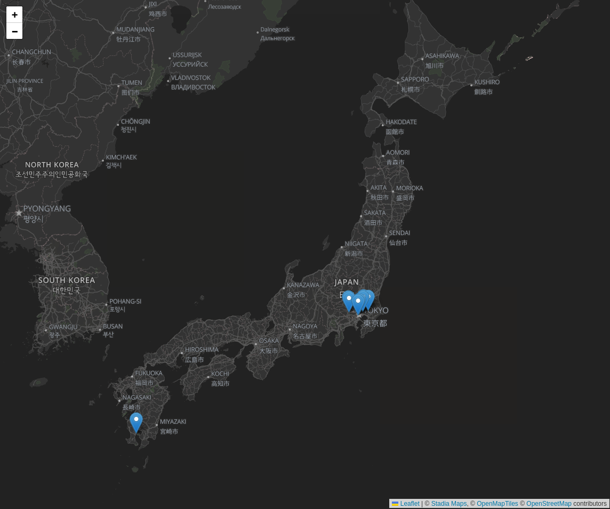

# Getting Started with Stadia Maps, Vue 3, and Leaflet

This project will get you started using [Stadia Maps](https://stadiamaps.com/) in your Vue application using
[Vue Leaflet](https://github.com/vue-leaflet/vue-leaflet).

## Quickstart

This repository is organized into directories, one for each major plugin. Right now that's just Leaflet, so to get started:

```shell
cd leaflet
```

Then it's nothing magical, just your usual npm sequence:

```shell
npm install
npm dev
```

Your browser should open automatically, showing a map of all video arcades in Japan, using OpenStreetMap
data fetched using [this Overpass Turbo query](https://overpass-turbo.eu/s/1r4V) on Feb 7, 2023.

## Vector support

Coming soon! We will provides a vector example using the [MapLibre GL Leaflet](https://github.com/maplibre/maplibre-gl-leaflet)
plugin. 


